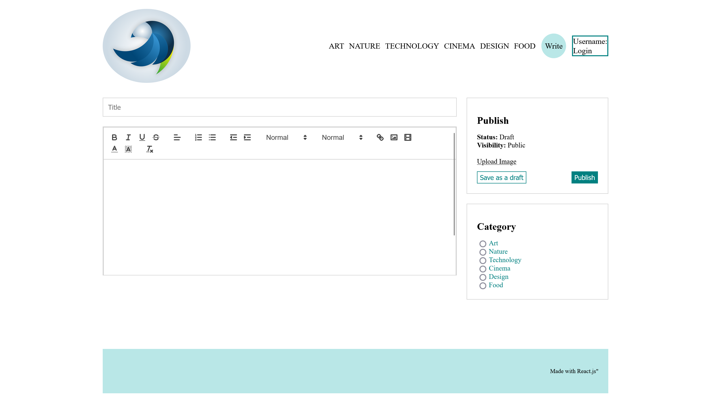
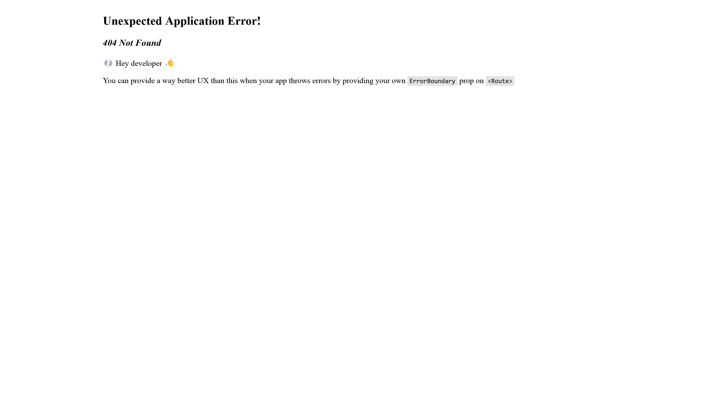
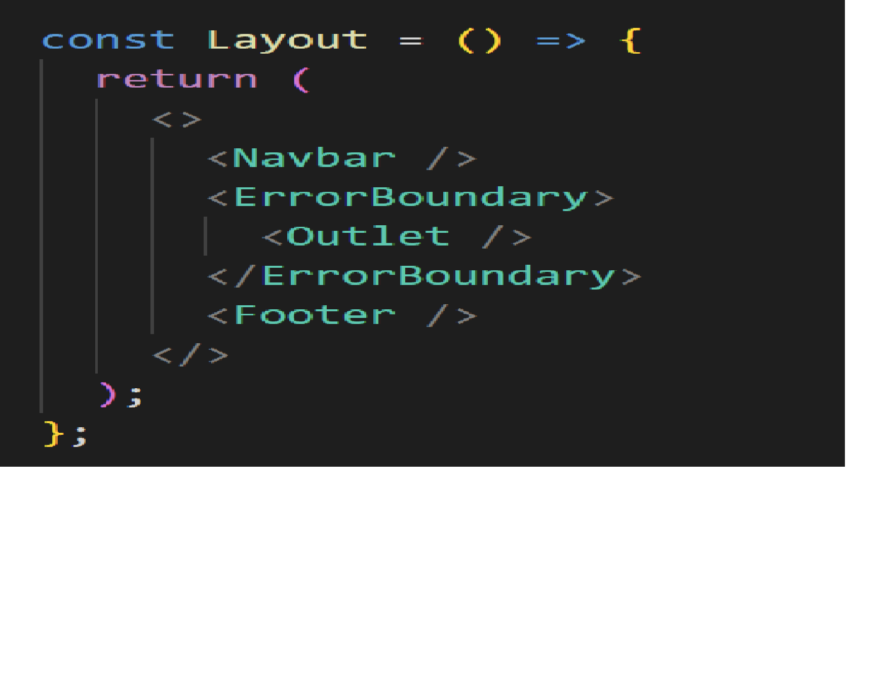

# About
Blog application allowing users to create posts while also uploading images about various topics. 

# Screenshot

# Problems / Solutions
<h3>Problem #1</h3>

After uploading to github we received a 404 message(screenshot below).

<h3>Solution #1</h3>

To fix the error we use errorBoundary. An ErrorBoundary is a React component that catches errors that occur during rendering, in lifecycle methods, and in constructors of the whole tree below them. It allows you to handle the error gracefully and display a fallback UI instead of crashing the application. 

After importing errorBoundary, to apply an ErrorBoundary component to your code, I wrapped the <Outlet /> component inside the <Layout /> component with the ErrorBoundary component.

<h2></h2>
<h3>Problem #2</h3>

Initially opening the project would start on route path of /blog. The problem is that the page would initially state a 404 error message.

Since there technically was not path routed to /blog, I attempted to add a blog path to the parent element of Layout while making other small adjustments. While a series of other issues arose, it did not fix my primary problem.

<h3>Solution #2</h3>

After making a few minor adjustments to the router paths, I added a /blog path as a direct child element of layout.

 
